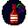
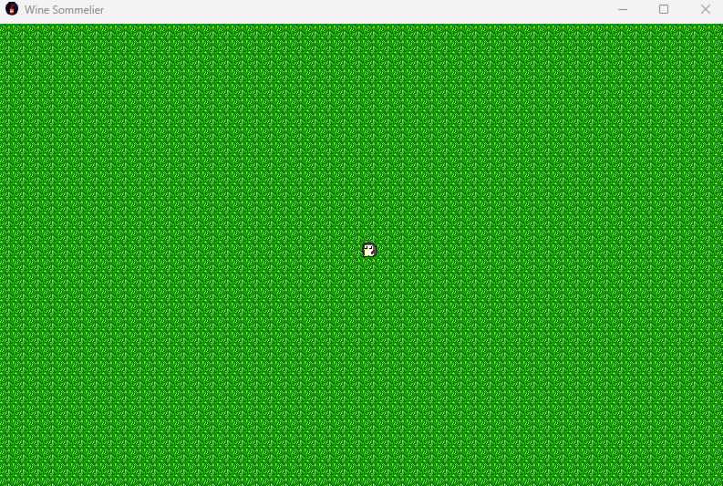

# Wine Sommelier
<h1>2D Java Game</h1>

<h2>Description</h2>
Im developing this game to learn more about the Java language and to learn some programming skills surrounding game development and some skills such as pixel art and map creation. 
 

<h2>Languages and Utilities Used</h2>

- <b>Java</b> 
- <b>Gradle</b>
- <b>Tiled</b>
- <b>Piskel</b>
- <b>IntelliJ</b>

<h2>Environments Used </h2>

- <b>Windows 11</b> 
